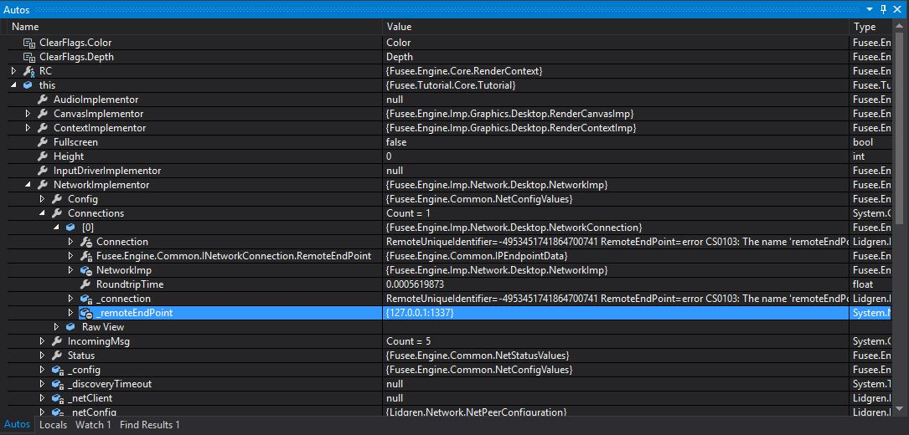

# Fusee Network Tutorial
This tutorial will help you getting started with the network capabilities with some examples for desktop. 
You will learn about how to establish a connection between a client and a server application, how to create these and send data over the network. The tutorial is based on the [sixth official Tutorial](https://github.com/griestopf/Fusee.Tutorial/tree/master/Tutorial06) from [Fusees tutorial page](https://github.com/griestopf/Fusee.Tutorial).

##Getting started
To make this tutorial as easy as possible, the client and server application are two seperated solutions. This will help you seperate the role of each application at any time.

Before you start, make sure you have the latest version of Fusee, your ```FuseeRoot``` enviroment variable is set on your system and points to the right location. Also build the ```Fusee.Engine.Imp.Network.Desktop.csproj``` in the ```Fusee.Engine.Simple.sln```. You will need the generated .DLL-File for the next steps.

###Server

###Client

##Your first connection with Fusee

###Server
To set up the server, go to the ```Init()``` method in ```Tutorial.cs``` from the ```Fusee.TutorialNetworkServer.sln``` and add the following lines:

  ```C#
  Network netCon = Network.Instance;
  netCon.Config.SysType = SysType.Server;
  netCon.StartPeer();
  ```
First you need a reference to the ```Network.Instance``` object, which is a singelton in Fusee. Next you configure this reference as server and start it. ```StartPeer()``` starts the server application on the default port 14242 but you can also start it on a custom port by passing it as a parameter.

That's it! The server runs on the default port and is available under your machines IP address (or 127.0.0.1 from the same machine).

###Client
Configuring the client application is similar. Add this to the ```Init()``` method in ```Tutorial.cs``` from the ```Fusee.TutorialNetworkClient.sln```:

 ```C#
  Network netCon = Network.Instance;
  netCon.Config.SysType = SysType.Client; ;

  netCon.StartPeer(1337);
  netCon.OpenConnection("127.0.0.1");
  ```
  
 Besides the configuration as client, you also have to start a peer (note that the client peer is started on a certain port, because the server runs on the same machine and already uses the default port 14242). Next you open a connection to a certain IP address (in this case to the localhost).
 
 ###Test your code
 To verify, that the client connects to your server follow these steps:
 
 - 1. Start the ```Fusee.TutorialNetworkServer.sln```
 - 2. Start the ```Fusee.TutorialNetworkClient.sln```
 - 3. Set a breakpoint somewhere in ```RenderAFrame()``` in ```Tutorial.cs``` in the server solution
 
When you look in the Autos window in Visual Studio and search for ```this.NetworkImplementor.Connections[0]._remoteEndpoint``` you should see the clients IP address and port, connected to the server:




###Make the server react to connecting clients
Now, that the client is connected with the server, you will see how to react on connection updates. Therefore you implement an event listener inside the servers ```RenderAFrame()``` method in ```Tutorial.cs```:

 ```C#
  Network.Instance.OnConnectionUpdate += ConnectionUpdate;
 ```
Everytime, a connection on the ```Network.Instance``` changes, ```ConnectionUpdate()``` is called. Implement the ```ConnectionUpdate()``` method somewhere in ```Tutorial.cs```:

 ```C#
 private void ConnectionUpdate(ConnectionStatus estatus, INetworkConnection connection)
 {
   Debug.WriteLine("Connection update from: " + connection.RemoteEndPoint.Address + " which connected from port: " + connection.RemoteEndPoint.Port + ". Status: " + estatus);
 }
 ```
 
Repeat the steps from the [Test your code](#Test your code) section and look at the Output window in Visual Studio of your server solution. When the client application starts, you should see a similar message to this:


Server: isServer
Client: IP, Port
Breakpoint
##
